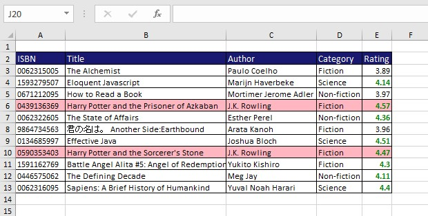
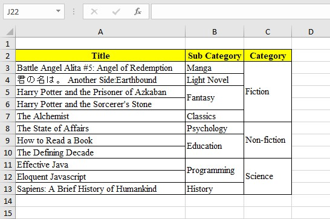

# Data Excel Exporter

[](https://mvnrepository.com/artifact/io.github.nambach/ExcelUtil)

A Java wrapper using [Apache POI](http://poi.apache.org/components/spreadsheet/quick-guide.html) to read and write Excel file in declarative fashion.

## Installation

```xml
<dependency>
    <groupId>io.github.nambach</groupId>
    <artifactId>ExcelUtil</artifactId>
    <version>2.0</version>
</dependency>

<!-- Apache POI dependencies -->
<dependency>
    <groupId>org.apache.poi</groupId>
    <artifactId>poi</artifactId>
    <version>4.1.2</version>
</dependency>
<dependency>
    <groupId>org.apache.poi</groupId>
    <artifactId>poi-ooxml</artifactId>
    <version>4.1.2</version>
</dependency>
```

## Write Excel

Your DTO class should follow `camelCase` convention. Let us have some clasess.

```java
@Getter
@Setter
public class Book {
    private String isbn;
    private String title;
    private double rating;
    private Date firstPublished;
    private String author;
    private String subCategory;
    private Category category;

    @Getter
    @Setter
    public static class Category {
        private long id;
        private String name;
    }
}
```

### **A very simple usage**

The building block to write data is class `DataTemplate<T>`. Declare your `DataTemplate<T>` for every classes of DTO you want to export Excel.

```java
public class Main {

    static final DataTemplate<Book> BOOK_TEMPLATE = DataTemplate
            .fromClass(Book.class)
            .includeAllFields();

    public static void main(String[] args) {
        InputStream stream = BOOK_TEMPLATE.writeData(books);

        FileUtil.writeToDisk(".../books.xlsx", stream, true);
    }
}
```

### **Wanna customize more?**

```java
public class Main {

    // It is recommended to pre-define your styles in a file, since
    // Apache POI limits the total number of styles in one workbook
    static final Style HEADER_STYLE = Style
            .builder()
            .fontName("Calibri").fontSize((short) 12)
            .fontColorInHex("#ffffff")  // white
            .backgroundColorInHex("#191970")  // midnight blue
            .border(BorderSide.FULL)
            .horizontalAlignment(HorizontalAlignment.LEFT)
            .build();

    static final Style DATA_STYLE = Style
            .builder()
            .fontName("Calibri")
            .fontSize((short) 11)
            .border(BorderSide.FULL)
            .build();

    static final Style HIGH_RATE = Style
            .builder().bold(true)
            .fontColorInHex("#008000")  // green
            .build();

    static final Style FAVORITE_ONE = Style.builder().backgroundColorInHex("#FFB6C1").build();


    static final DataTemplate<Book> BOOK_TEMPLATE = DataTemplate
            .fromClass(Book.class)
            .column(c -> c.field("isbn").title("ISBN"))  // customize column title
            .includeFields("title", "author")
            .column(c -> c.title("Category")
                          .transform(book -> book.getCategory().getName()))  // derive new column
            .column(c -> c.field("rating")
                          .conditionalStyle(book -> book.getRating() > 4f ?  // styles with conditions
                                                    HIGH_RATE : null))
            .config(cf -> cf.startAtCell("A2")
                            .autoResizeColumns(true)
                            .headerStyle(HEADER_STYLE)  // some sorts of configuration
                            .dataStyle(DATA_STYLE)
                            .conditionalRowStyle(book -> book.getTitle()
                                            .contains("Harry Potter") ? FAVORITE_ONE : null));

    public static void main(String[] args) {
        InputStream stream = BOOK_TEMPLATE.writeData(books);

        FileUtil.writeToDisk(".../books.xlsx", stream, true);
    }
}
```

#### Result



### **Anything else?**

You can even merge your data rows for report purpose, by configure which column on the template as below.

```java
static final Style VCENTER = Style.builder().verticalAlignment(VerticalAlignment.CENTER).build();

    static final DataTemplate<Book> BOOK_TEMPLATE = DataTemplate
            .fromClass(Book.class)
            .column(c -> c.field("isbn").title("ISBN"))
            .includeFields("title", "rating")
            .column(c -> c.field("subCategory")
                          .style(VCENTER)
                          .mergeOnValue(true))  // merge your rows based on cell value
            .column(c -> c.title("Category")
                          .style(VCENTER)
                          .transform(book -> book.getCategory().getName())
                          .mergeOnId(book -> book.getCategory().getId()))  // merge rows based on specific value
            .config(cf -> cf.startAtCell("A2")
                            .autoResizeColumns(true));
```

Before doing so, you might want to sort your data so that the merging process can perform correctly.

```java
    ListUtil.sort(books, compare -> compare
        .on(criterion -> criterion.value(book -> book.getCategory().getId()))
        .on(criterion -> criterion.value(Book::getSubCategory).desc())  // by default is .asc()
        .on(criterion -> criterion.value(Book::getTitle)));
```

#### Result


